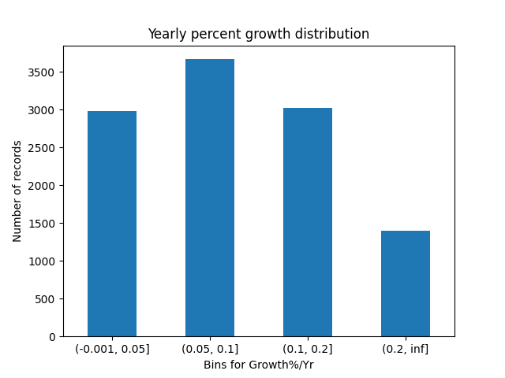

# AI-Final-Project
Using applied data science techniques to analyze a [Forest Ecology dataset](https://data.nal.usda.gov/dataset/c-55-thinning-and-fertilization-western-redcedar-c55-wrc-tf) measuring tree growth in response to thinning and fertilization in the western Olympic Peninsula over several years.

## Environment setup
- Create fresh environment using python=3.8
- `pip install -r requirements.txt`

# Methodology

## Analysis target
Our goal was to calculate and predict the average growth per year of all trees measured in the study. We derived `Growth%/Yr` using tree width measurements from 1982, 1985, and 1990 and measuring the percent change across those time periods. We then used a variety of neural network approaches to predict the `Growth%/Yr` based on a variety of input variables.

## Input variables
Several measures were used to predict tree growth:
- Tree species
- Nutrient levels in fallen foliage:
  - Nitrogen concentration (%)
  - Phosphorus concentration (%)
  - Potassium concentration (%)
  - Sulfur concentration (%)
  - Calcium concentration (%)

## Assumptions:
- Trees growth rate is not affected by the trees age
- Foliar nutrient levels are measured at the beginning of the growing time period
- Foliar nutrients remain constant over growth period
- Foliar nutrients for a plot is the same for all trees within that plot
- The same tree may have `Growth%/Yr` calculated from it twice (once from 82-85, once from 85-90)

## Data derivation

### **Percent growth per year**:
- D82 = 1982 Tree diameter at breast height
- D85 = 1985 Tree diameter at breast height
- D90 = 1990 Tree diameter at breast height
 
1982-1985 period `Growth%/Yr` = (D85 - D82)/(D82 * 3 Yrs)

1985-1990 period `Growth%/Yr` = (D90 - D85)/(D85 * 5 Yrs)
  
### **Foliar nutrients**:
- 1982 measurements associated with tree growth during 1982-1985 
- 1985 measurements associated with tree growth during 1985-1990

### **Tree species**:
- THPL
- TSHE
- PISI
- ALRU2
- RHPU
- TABR2
- UNCLH 
- ABAM
- ABGR
- MAFU
- TSME

# Statistical Models

## Regression

## Classification
For the classification model we created a neural network to predict which bin the growth rate would fall into. The bins for `Growth%/Yr` we chose were [0,5%], (5%, 10%], (10%, 20%], and (20%, inf) based on the distribution of records. 

Classification of continuous variables has many inherent challenges. First, there is a natural loss of information as the singular prediction value is transformed into a range of values within the bin. Second, if there is a high error in prediction, there is a large possibility of classification predictions crossing binning lines, which leads to an innacurate prediction. 

Upon running a classification model for the `Growth%/Yr` for the trees, the results were all over the place. The peak accuracy was a bit less than 60% accurate, while the worst accuracy was around 10% accurate. However, the results were inconsistent as consecutive runs using the same neural network structure at one point yielded accuracies differing by over 30%! Therefore, due to the inconsistencies in the model, as well as its inaccuracy we did not pursue the classification model further. 

## Helpful sources:

Possible ways to increase accuracy of neural network
https://towardsdatascience.com/how-to-increase-the-accuracy-of-a-neural-network-9f5d1c6f407d

How to choose activation function
https://machinelearningmastery.com/choose-an-activation-function-for-deep-learning/

Batch size and epochs: 
https://towardsdatascience.com/epoch-vs-iterations-vs-batch-size-4dfb9c7ce9c9#:~:text=Note%3A%20The%20number%20of%20batches,iterations%20to%20complete%201%20epoch.

Good source on layers and nodes:
https://machinelearningmastery.com/how-to-configure-the-number-of-layers-and-nodes-in-a-neural-network/

Classification:
https://towardsdatascience.com/building-our-first-neural-network-in-keras-bdc8abbc17f5 